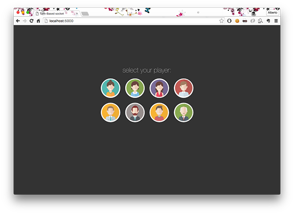
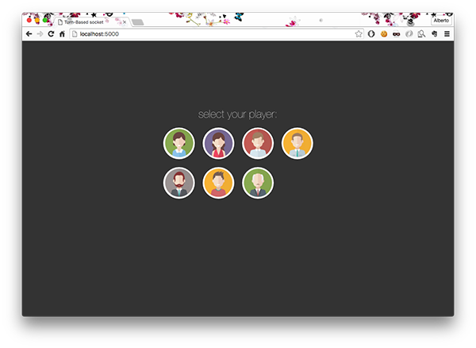
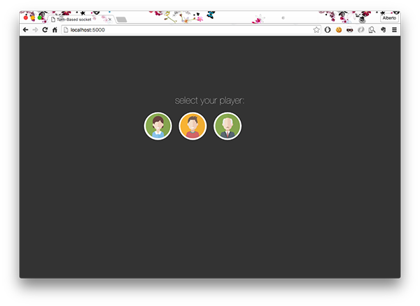
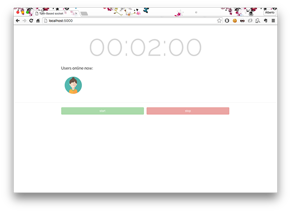
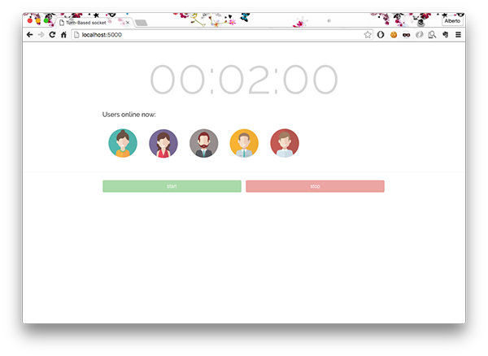
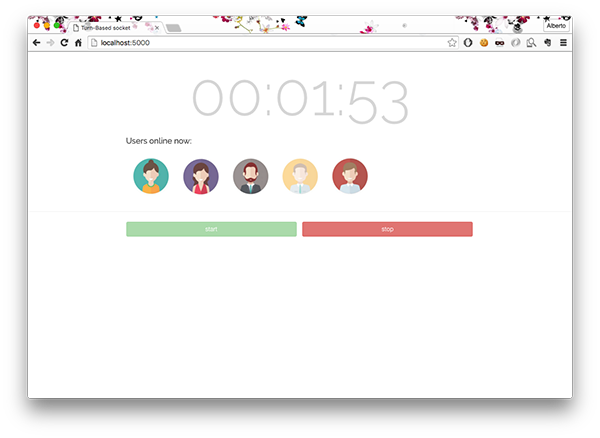
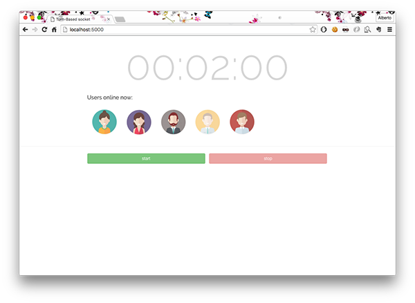

# Turn-Based websocket example

> **Sample demo using nodeJS / socket.io**

 

##How it works?
> - There is a list of customizable players.   
>   **Select one** and wait for others player...  
> - Other users see **live** the same selection and the same actions that you make.  
> - Press start / stop to start time countdown.  
> - If using Chrome browser, in the end you should see a *Desktop Notification*.
> - Very easy, stupid and full of bugs.

##Installation

**package.json** content: 
 
	{
	  "name": "Turn-Based socket",
	  "version": "1.0.0",
	  "description": "A Turn-Based socket time-tool.",
	  "main": "index.js",
	  "author": "Alberto Pasca",
	  "private": false,
	  "license": "MIT",
	  "dependencies": {
	    "express": "3.4.8",
	    "engine.io": "1.6.8",
	    "socket.io-parser": "2.2.6",
	    "socket.io-client": "1.4.5",
	    "socket.io-adapter": "0.4.0",
	    "has-binary": "0.1.7"
	  }
	}

Use **NPM** to install **package.json**  

 	$ npm install  

To start server, simply type:

	$ node .

or  (if you have installed **heroku toolbet** ([https://dashboard.heroku.com/]()))

	$ heroku local

Usually localhost is on port 5000: [http://localhost:5000]()
	

#### Demo screenshots:
-------------
####Players list:

  

When a user select a player, this one is removed from list.

----------

####Users online now:

The selected users (from login page) goes here...

----------

####Player selection / Start|Stop:

  
Select a user to start/stop countdown (turn based)

----
#####Every peoples connected to this page, see the live events.

##Known bugs:
- a lot. It's simple starting point project. Less than a MVP.
- If you want to fix, you're welcome!

##Reference:

This example was made editing the *socket.io chat example*: [http://socket.io/]()  

3rd party:  

 - [https://jquery.com/]()  
 - [http://hilios.github.io/jQuery.countdown/]()
 - Player images from google images.

 

##License:

> The MIT License (MIT)

> Copyright (c) 2016 alberto

> Permission is hereby granted, free of charge, to any person obtaining a copy
of this software and associated documentation files (the "Software"), to deal
in the Software without restriction, including without limitation the rights
to use, copy, modify, merge, publish, distribute, sublicense, and/or sell
copies of the Software, and to permit persons to whom the Software is
furnished to do so, subject to the following conditions:

> The above copyright notice and this permission notice shall be included in all
copies or substantial portions of the Software.

> THE SOFTWARE IS PROVIDED "AS IS", WITHOUT WARRANTY OF ANY KIND, EXPRESS OR
IMPLIED, INCLUDING BUT NOT LIMITED TO THE WARRANTIES OF MERCHANTABILITY,
FITNESS FOR A PARTICULAR PURPOSE AND NONINFRINGEMENT. IN NO EVENT SHALL THE
AUTHORS OR COPYRIGHT HOLDERS BE LIABLE FOR ANY CLAIM, DAMAGES OR OTHER
LIABILITY, WHETHER IN AN ACTION OF CONTRACT, TORT OR OTHERWISE, ARISING FROM,
OUT OF OR IN CONNECTION WITH THE SOFTWARE OR THE USE OR OTHER DEALINGS IN THE
SOFTWARE.
